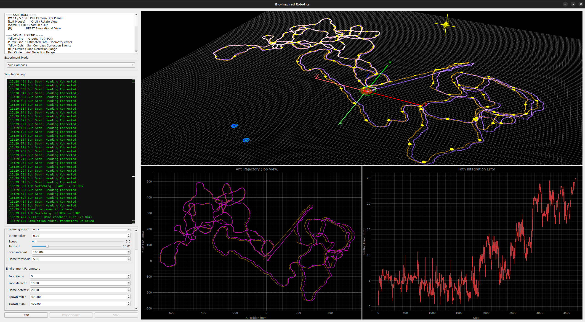
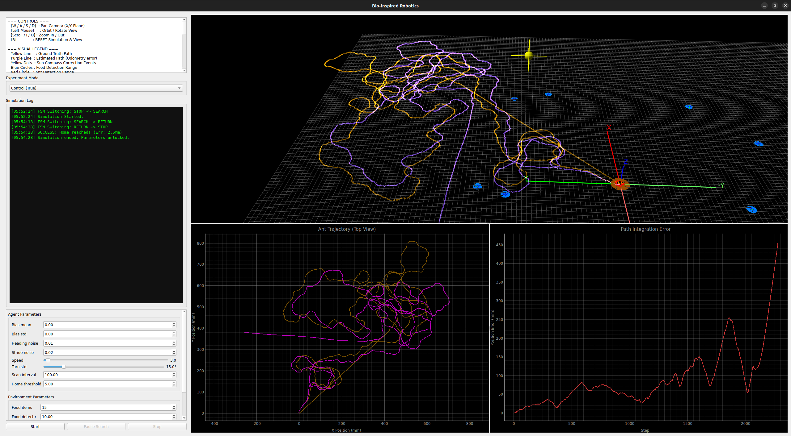

# Bio-Inspired Navigation Simulation 🐜 🤖

### *Stochastic State Estimation & RL Framework for Infrastructure-Free Navigation*

 
 
 


---

## 📖 Overview

This project is a high-fidelity **navigation research framework** inspired by the desert ant *Cataglyphis*. It explores the transition from **Idiothetic Path Integration** (noisy internal odometry) to **Allothetic Correction** (global orientation cues).

By implementing a recursive **Extended Kalman Filter (EKF)** and a standardized **Gymnasium wrapper**, this tool allows researchers to benchmark heuristic navigation policies against Reinforcement Learning (RL) agents in feature-sparse environments where traditional Visual SLAM fails due to perceptual aliasing.

---

## 🧠 Technical Core: The EKF Brain

This Python (PyQtGraph + OpenGL) framework maintains a **Gaussian Belief State** $\mathcal{N}(\hat{q}, P)$ using a decoupled recursive estimator.

### 1. Stochastic Prediction ($P = F_x P F_x^\top + G Q G^\top$)

- **Non-linear Kinematics:** Models the $SE(2)$ motion of the agent using Jacobian-based linearization.
- **Uncertainty Propagation:** Tracks how heading error "sloshes" into positional variance. This is visualized via real-time **Error Ellipses** representing 50% and 95% confidence intervals.
- **Tunable Process Noise:** High-precision control over the $Q$ matrix to simulate varying degrees of mechanical slip and compass jitter.

### 2. Allothetic Measurement Update ($h$)

- **Sun Compass Integration:** Periodically samples global heading ($z$) to perform a statistical correction.
- **Covariance Pinch:** Demonstrates the "collapse" of angular doubt, which implicitly corrects correlated spatial drift through the cross-covariance terms in the $P$-matrix.

---

## 🎮 Gymnasium RL Testbed

The entire simulation is wrapped in a **Gymnasium** interface, decoupling the physics engine from the control policy. This transforms the simulation into an API-driven platform.

- **Belief-State Observation Space:** The agent observes a 5D vector derived from the EKF, not ground truth:
  - `[estimated_dist_to_home, estimated_bearing, trace(P), var(heading), has_food]`
- **Normalized Action Space:** Continuous steering $[-1, 1]$ mapped to the agent's kinematic constraints.
- **Headless Training:** Optimized for high-speed training (e.g., Stable Baselines3) without the overhead of the 3D renderer.

---

## 🏗️ Modular Architecture

The framework follows a strict **Decoupled Architecture** using dependency injection:

1. **Simulation Core:** Pure Python/NumPy logic for kinematics and EKF state estimation.
2. **Gymnasium Adapter:** Standardized API wrapper for RL research.
3. **Visualization Layer:** Real-time PyQtGraph + OpenGL 3D renderer for divergence analysis.

---

## 📊 Visual Ledger

- **Yellow Path:** Ground Truth ($q_{true}$) — The physical reality.
- **Purple Path:** EKF Mean Belief ($\hat{q}$) — The ant's internal memory.
- **Green Rings:** Dual-layer uncertainty ellipses (50% and 95% confidence).
- **Yellow Dots:** EKF Measurement Update events (Sun Scans).

| Sun Compass Mode (Stable) | Blind Navigation (Diverging) |
| :---: | :---: |
|  |  |
| *Frequent updates bound the covariance growth.* | *Heading drift leads to "Cigar-shaped" uncertainty.* |

---

## 📹 Video Demonstrations

| Mode | Description | Link |
|------|-------------|------|
| **Mode 1** | Blind Navigation (Estimated Position) | [Watch](https://youtu.be/pHUvMSFNvnA) |
| **Mode 2** | Control Baseline (True Position) | [Watch](https://youtu.be/J1Nd_F9FPd4) |
| **Mode 3** | Path Integration + Sun Compass | [Watch](https://youtu.be/WiiOwJ9P_O8) |

---

## 🚀 Quick Start

### 1. Installation

```bash
# Clone the repository
git clone https://github.com/GODCREATOR333/Bio-inspired-Robotics.git
cd Bio-inspired-Robotics

# Install core dependencies
pip install -r requirements.txt
```

### 2. Choose Your Mode

#### Option A: Interactive GUI (Standard)

Experiment with sliders, switch modes, and visualize EKF uncertainty and error eliipse in real-time.

```bash
python main.py
```

#### Option B: RL Test Bed (API)

Interact with the simulation as a standardized Gymnasium environment for training RL agents.

```bash
pip install -r requirements-rl.txt

# Test with random policy
python main_RL.py

# Train PPO agent
python train_ppo.py
```

---

## 📊 Visual Legend & Instructions

### Visual Elements

| Element | Representation |
|---------|----------------|
| **Yellow Line** | Ground Truth Path ($q_{true}$) — Physical reality |
| **Purple Line** | Estimated Mean Path ($q_{est}$) — Odometry with error |
| **Purple Dot** | Current EKF Mean Belief (Mean) |
| **Green Rings** | Uncertainty Ellipses ($P$-Matrix): Inner (50% CI), Outer (95% CI) |
| **Yellow Dots** | Allothetic Sun-Scan Correction Events (Measurement Updates) |
| **Red/Blue/Brown** | Detection ranges for Ant, Food, and Home respectively |

### Parameter Guide

- **Heading Bias (Mean/Std):** Models systematic drift and run-to-run variability (Secret to the EKF).
- **Heading/Stride Noise:** Stochastic jitter (Process Noise $Q$).
- **Sun Sensor Std:** Measurement noise ($R$-Matrix). Controls Kalman Gain ($K$) and update "snap."
- **EKF Trust Scale:** Multiplier for $Q$-Matrix. Higher values induce filter "pessimism" (faster $P$ growth).

---

## 🧪 Experiment Modes

1. **Blind Navigation (Est Pos):**
   - Relies purely on recursive EKF prediction (Dead-Reckoning).
   - Expectation: Monotonic uncertainty growth and eventual divergence (slingshot effect).

2. **Control Group (True Pos):**
   - Uses "God Mode" (True Coordinates).
   - Expectation: Zero-drift, perfect straight-line homing.

3. **Sun Compass (Corrected):**
   - Implements periodic EKF Measurement Updates ($h$) similar to cataglyphis ant *Stop and Turn* behaviour.
   - Expectation: Bounded orientation error and covariance "pinch" during updates.

---

## 📈 Results Summary

Data averaged over N = 10 independent trials per mode.

| Mode | Strategy | Success Rate | Mean Terminal Error |
|------|----------|--------------|---------------------|
| 1. Blind (Est) | Path Integration Only | 10% | 52.00 mm |
| 2. Control | Ground Truth Baseline | 100% | 2.96 mm |
| 3. Sun Compass | EKF Predict + Update | 90% | 9.72 mm |

---

## 🕹️ Controls

| Key / Mouse | Action |
|-------------|--------|
| **W / A / S / D** | Pan Camera (X/Y Plane) |
| **Left Mouse** | Orbit / Rotate View |
| **Scroll / I / O** | Zoom In / Out |
| **R** | Reset Simulation & View |

---

## 🤖 Reinforcement Learning Integration

### Architecture Overview

The RL wrapper (`agent_env.py`) provides a clean Gymnasium interface without modifying the original simulation code:

```python
# Observation Space (5D):
# [distance_to_home, bearing_to_home, position_uncertainty, 
#  heading_uncertainty, has_food_flag]

# Action Space (1D continuous):
# steering_angle ∈ [-1, 1]
```

### Key Features

- **Belief-State Learning:** Agent learns from noisy EKF estimates, not ground truth
- **Uncertainty-Aware:** Observes uncertainty metrics to make risk-aware decisions
- **Two-Phase Task:** Search for food → Return home with food
- **Realistic Noise:** Inherits all noise models from the original EKF simulation

## 🧩 Project Context

This work was developed as part of the selection task for the **FedEx SMART Project** at **IIT Madras** (Dept. of Applied Mechanics and Biomedical Engineering).

**Objective:** To codify biological navigation behaviors observed in *Cataglyphis* ants and evaluate their applicability to autonomous warehouse logistics via state estimation and reinforcement learning.

---

## 📄 License

This project is licensed under the MIT License .

---


